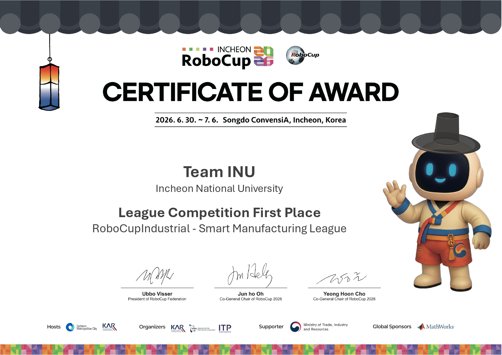

# 🏆 2026 RoboCup 작업 기록

> 📄 **[기존 원본 README.md 보기](./O.G_README.md)**

---

## 🏆 1. RoboCup 수상 사진

---

## 📰 2. 단체 사진

---

## 📂 3. 내가 작업한 파일 목록
- 📄 [파일 이름/경로 1](./src/my_code.py) : 작업 내용 간단 요약
- 📄 [파일 이름/경로 2](./launch/robot_launch.py) : 작업 내용 간단 요약
- 📁 [내가 작성한 폴더](./my_package/) : 패키지 설명

---

## 🔗 4. 관련 링크
- 📄 [기존 원본 README.md](./README.md)
- 🌐 [인천대, 첫 출전 로보컵 세계 제패…AI·로봇 인재양성 결실](https://www.m-i.kr/news/articleView.html?idxno=1388989)
- 🌐 [인천시, 로보컵 2026 성황리 폐막...로봇산업 생태계 확장 기대](https://www.kmaeil.com/news/articleView.html?idxno=644469)
